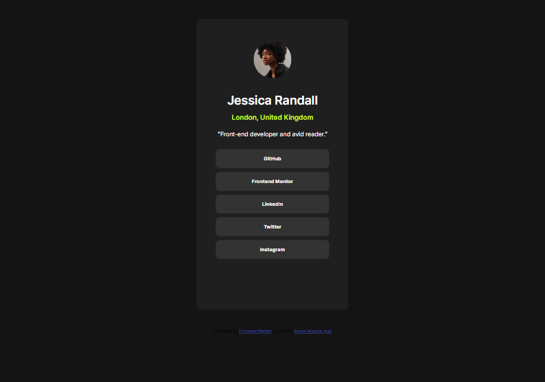

# Frontend Mentor - Social links profile solution

This is my solution to the [Social links profile challenge on Frontend Mentor](https://www.frontendmentor.io/challenges/social-links-profile-UG32l9m6dQ). This challenge helped me practice responsive design and improve my HTML and CSS skills.

## Table of contents

- [Overview](#overview)
  - [The challenge](#the-challenge)
  - [Screenshot](#screenshot)
  - [Links](#links)
- [My process](#my-process)
  - [Built with](#built-with)
  - [What I learned](#what-i-learned)
  - [Continued development](#continued-development)
  - [Useful resources](#useful-resources)
- [Author](#author)
- [Acknowledgments](#acknowledgments)

**Note: Delete this note and update the table of contents based on what sections you keep.**

## Overview

### The challenge

Users should be able to:

- See hover and focus states for all interactive elements on the page
- View the design optimized for both mobile (375px) and larger screens

### Screenshot

### Links

- Solution URL: [Add solution URL here](https://github.com/joelanarba/social-links-profile)
- Live Site URL: [Add live site URL here](https://joelanarba.github.io/social-links-profile/ )

## My process

### Built with

- Semantic HTML5 markup
- CSS custom properties
- Flexbox
- Mobile-first workflow

### What I learned

This project helped me reinforce my understanding of:

- Mobile-first design principles

- Handling image positioning without position: relative where unnecessary

- Avoiding overflow: hidden; when it affects the responsiveness negatively

- Using margin and padding effectively to create a balanced layout

### Continued development

In future projects, I want to:

- Improve my CSS layout skills with Grid and Flexbox

- Experiment more with animations and transitions

- Dive deeper into accessibility best practices

### Useful resources

- [MDN Web Docs - Responsive Design](https://developer.mozilla.org/en-US/docs/Learn_web_development/Core/CSS_layout/Responsive_Design) - Provided useful insights into making my design responsive.

## Author

- Frontend Mentor - [@joelanarba](https://www.frontendmentor.io/profile/joelanarba) 
- GitHub - [@joelanarba](https://github.com/joelanarba)
- LinkedIn - [@joelanarba](https://www.linkedin.com/in/joelanarba/)

## Acknowledgments

Big thanks to the Frontend Mentor community for providing such amazing challenges. Also, a special shoutout to everyone who shares tips and solutions,it’s always great to learn from others.